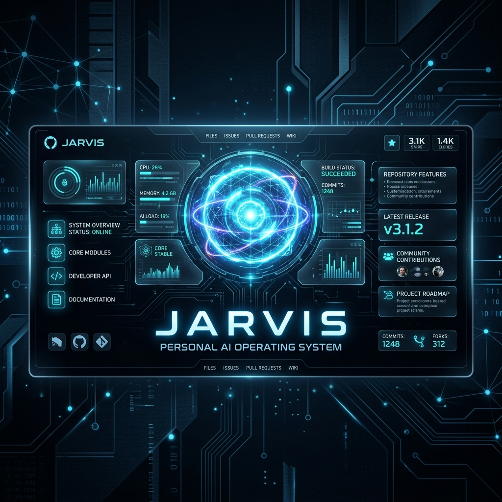
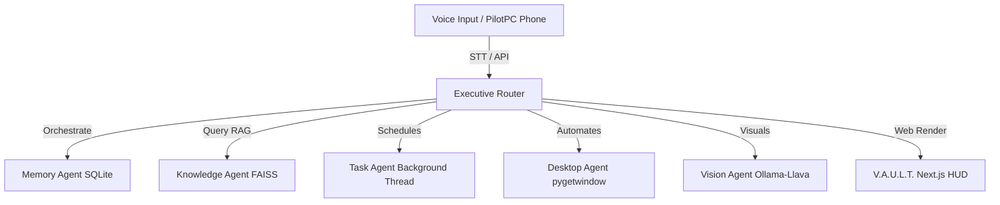

# J.A.R.V.I.S. — Personal AI Operating System

J.A.R.V.I.S. (Voice-Activated Unified Logic Terminal) is an advanced desktop assistant transitioning into a proactive operating system companion. It is designed to bridge the gap between hardware automations and intelligent agent systems, running on a multi-threaded Python core with a high-fidelity Web HUD.

📺 **Interactive Voice &amp; UI Demo**:


---

## ⚙️ Architecture & Core Components

J.A.R.V.I.S. uses an **Event-Driven Multi-Agent Architecture** coordinating specialized sub-units:



---

## 📂 Project Structure Blueprint

```text
JARVIS_OS/
├── gui/
│   ├── main_window.py       # PySide6 application window & QWebEngineView
│   ├── listening_orb.py     # 3D orb visualization widget
│   └── chat_widget.py       # Glassmorphic conversation thread
├── controller/
│   └── ai_worker.py         # Async QThread worker for AI logic
├── memory/
│   ├── db.py                # Database connection & schema definitions
│   └── manager.py           # Context extraction & semantic associations
├── ai/
│   ├── provider_manager.py  # Provider router (Ollama, Groq, OpenAI, Gemini)
│   └── base_provider.py     # Provider base class & error wrapper
├── voice/
│   ├── tts_manager.py       # Non-blocking Edge-TTS player
│   └── stt_manager.py       # Whisper speech recognition coordinator
├── commands.py              # Master keyword router & direct execution registry
├── run_gui.py               # Main entry point (resolves graphics, spawns server)
├── pilot_server.py          # FastAPI web server for remote control
└── pilotpc_mobile.html      # Mobile remote control web app
```

---

## 🧠 Specialized Sub-Agents

1. **Executive Agent (`commands.py`)**: Master command router. Intercepts speech-to-text inputs and coordinates command routing, choosing between direct keyword execution, dedicated sub-agents, or falling back to the cognitive LLM pipeline.
2. **Memory Agent (`memory/`)**: Cognitive permanent store using SQLite. Extracts user preferences, context, and long-term facts from conversations, enabling custom responses.
3. **Knowledge Agent (`ai/`)**: Implements Retrieval-Augmented Generation (RAG) using FAISS vector indexing. Crawls local documents, notes, and specs to answer queries with precise local knowledge.
4. **Task Agent (`controller/`)**: Spawns operations (APIs, system triggers) inside background daemon threads to prevent the GUI thread from freezing, ensuring smooth 60 FPS visual rendering.
5. **Desktop & Vision Agents (`system.py` / `browser.py`)**: Automates user workflows, reads desktop layouts via `pygetwindow`, and processes visual inputs using local vision models.

---

## 🎨 V.A.U.L.T. HUD UI (`gui/`)

* **WebGL Glassmorphic Interface**: Built with Next.js, Zustand, and Framer Motion, running inside a PySide6 `QWebEngineView` window.
* **3D Audio Orb**: Dynamic SVG/Canvas animations reactive to wake words, listening states, thinking loops, and speaking playback.
* **Hardware Acceleration**: Chromium switches integrated inside `run_gui.py` (`--enable-webgl`, `--ignore-gpu-blocklist`) for hardware-accelerated 3D rendering.

---

## 📡 PilotPC Remote Control (`pilot_server.py`)

* **FastAPI Server**: Spawns on startup in a daemon thread. Exposes static endpoints and WebSockets on a dynamically allocated port (starting from `8000`) on the local network.
* **Mobile Client**: Serve-ready HTML5 page with relative origins, allowing users to speak commands on their phones (Chrome/Safari) and trigger actions instantly on their PCs over local WiFi.
* **Dynamic Audio Player**: Plays premium Edge-TTS neural voices over SAPI SndPlayer fallback wrappers, bringing the premium assistant voice directly to the user.
